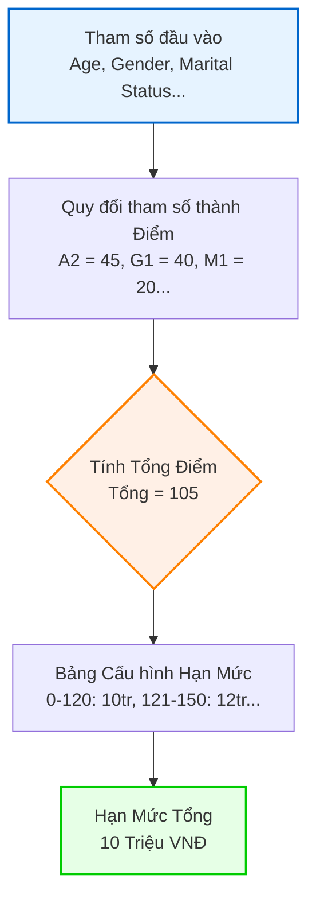
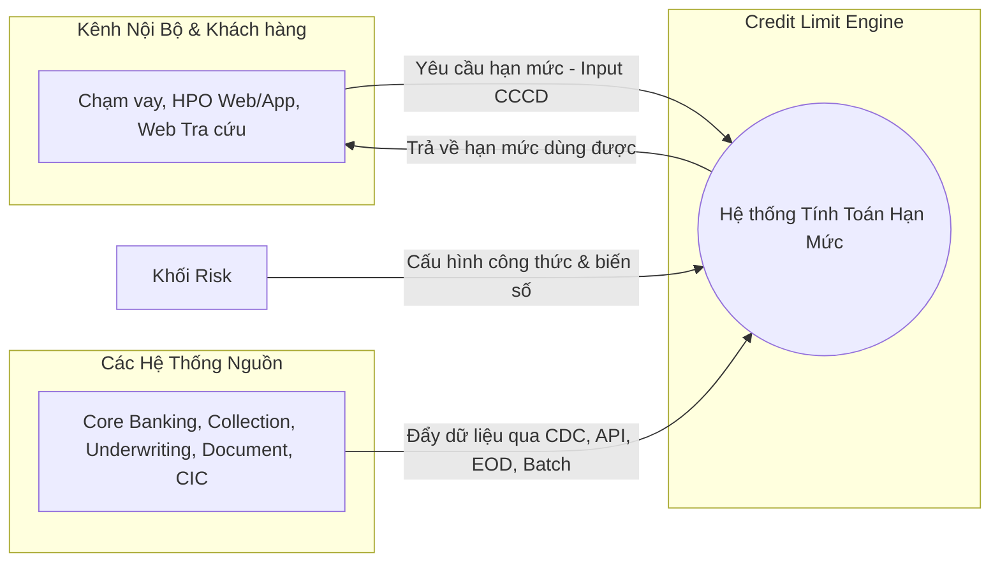
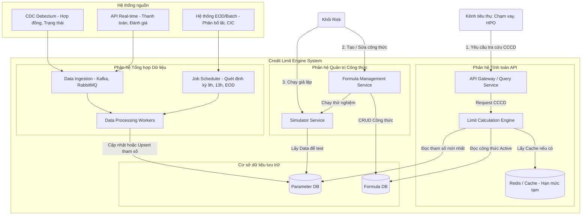
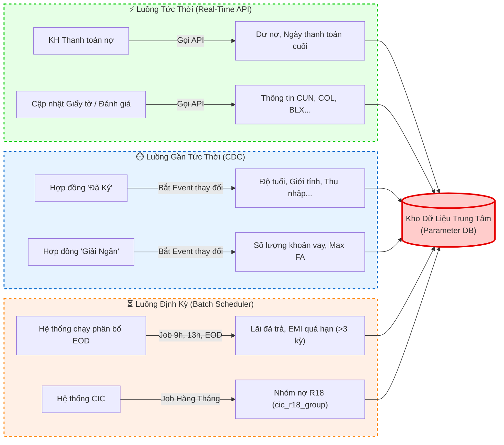
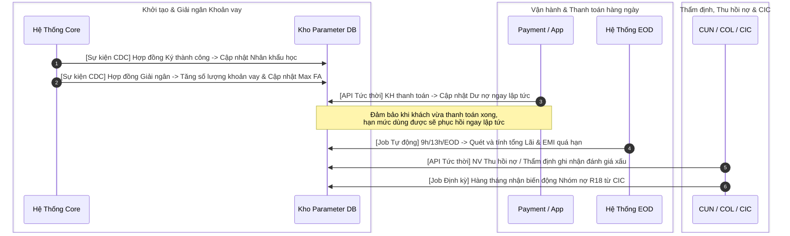
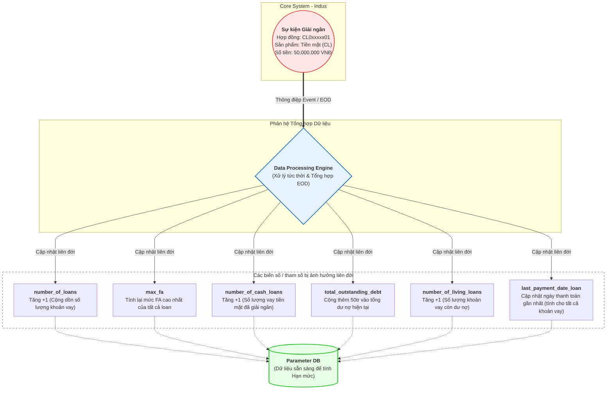

# Thiết Kế Hệ Thống: Credit Limit Engine (Hệ Thống Tính Toán Hạn Mức Tín Dụng)

## 0. Tóm tắt mục tiêu hệ thống
**Credit Limit Engine (CLE)** là hệ thống lõi giúp tính toán và cung cấp con số **"hạn mức dùng được"** của khách hàng cho bộ phận kinh doanh và các kênh nội bộ (Chạm vay, HPO web/app, website tra cứu). 

- **Đầu vào:** CCCD (Căn cước công dân) của khách hàng.
- **Đầu ra:** Hạn mức dùng được.
- **Quy tắc tính toán:** Các biến số/tham số thu thập được sẽ được quy đổi thành **Điểm (Score)**. Từ tổng điểm, hệ thống đối chiếu với bảng cấu hình để đưa ra **Hạn mức tổng**. Công thức do khối Risk thiết lập linh hoạt.

---

## 1. Cơ chế Tính Điểm và Quy đổi Hạn mức (Scoring & Limit Mapping)

Hệ thống hoạt động dựa trên nguyên tắc **chuyển đổi tham số/biến số thành Điểm số**, sau đó từ tổng điểm sẽ **quy đổi ra Hạn mức**.

### 1.1. Quy đổi Tham số thành Điểm (Parameter to Point)
Các biến số thu thập được sẽ được Risk cấu hình quy đổi thành điểm tương ứng. Ví dụ đối với một số biến số cơ bản:

*   **Độ tuổi (Age) sẽ bao gồm range điểm như:**
    *   A1: từ 18-22 tuổi sẽ tương ứng với 30 điểm
    *   A2: từ 23-30 tuổi sẽ tương ứng với 45 điểm
    *   A3: từ 31-40 tuổi sẽ tương ứng với 55 điểm
    *   A4: từ 41-50 tuổi sẽ tương ứng với 60 điểm
    *   A5: từ 51-N tuổi sẽ tương ứng với 65 điểm
*   **Giới tính (Gender) sẽ bao gồm:**
    *   G1: giới tính Nam tương ứng 40 điểm
    *   G2: giới tính Nữ tương ứng 80 điểm
*   **Tình trạng hôn nhân (Marital Status) sẽ bao gồm các giá trị:**
    *   M1: độc thân tương ứng 20 điểm
    *   M2: kết hôn tương ứng 50 điểm

*(Tương tự cho các tham số / biến số khác cũng sẽ có thông tin quy đổi điểm tương tự như các ví dụ trên).*

### 1.2. Quy đổi Điểm thành Hạn mức (Point to Limit)
Hạn mức sẽ được quy đổi từ Tổng điểm dựa vào bảng cấu hình sẵn. Ví dụ như:

*   0 - 120 điểm: 10tr
*   121 - 150 điểm: 12tr
*   151 - 170 điểm: 15tr
*   171 - 190 điểm: 18tr
*   191 - N điểm: 20tr

### 1.3. Ví dụ về áp dụng công thức để tính hạn mức
KH 27 tuổi, giới tính nam, độc thân sẽ là:
*   A2 + G1 + M1 = 45 + 40 + 20 = **105 điểm**
*   Tương ứng với **10 triệu** hạn mức tổng cho 1 đối tượng này.

### 1.4. Biểu đồ Luồng Tính toán Hạn mức (Scoring Flow)


---

## 2. Biểu đồ kiến trúc tổng quát (High-Level Architecture)
Biểu đồ này mô tả cách hệ thống CLE tương tác với các hệ thống bên ngoài (khu vực Data Sources) và các bên tiêu thụ (Consumers).



---

## 3. Biểu đồ kiến trúc chi tiết (Detailed System Design)
Biểu đồ này đi sâu vào các thành phần bên trong (Components) của hệ thống CLE và luồng xử lý dữ liệu (Data Pipeline).



---

## 4. Ý nghĩa và Thiết kế Cơ sở dữ liệu (Database Design)

Để hệ thống xử lý nhanh và linh hoạt, thiết kế Database nên chia làm 2 cụm chính: **Parameter DB** (Lưu biến số) và **Formula DB** (Lưu công thức và bảng điểm).

### 4.1. Parameter DB (Cơ sở dữ liệu lưu trữ biến số khách hàng)
> [!TIP]
> Do các tham số có thể thêm mới/thay đổi liên tục, hệ thống nên sử dụng cấu trúc lưu trữ phân mảnh. Ví dụ dạng bảng tĩnh kết hợp dữ liệu động JSON (trong PostgreSQL/MySQL) hoặc hệ thống NoSQL (như MongoDB) để tăng tốc độ Đọc/Ghi liên tục (Read/Write) từ quá trình CDC.

*   **Bảng `Customer_Master`** (Thông tin định danh lõi):
    *   `customer_id` (Primary Key)
    *   `cccd` (Index - Dùng để tra cứu nhanh)
*   **Bảng `Demographic_Document_Params`** (Nhóm Nhân khẩu học & Tài liệu - Cập nhật từ Hợp đồng mới/Thẩm định qua CDC):
    *   `customer_id` (Foreign Key)
    *   `age`, `martial_status`, `gender`, `province_rs`, `education`, `profession`, `monthly_income`
    *   `doc_blx`, `doc_health_insurance`, `doc_vehicle_reg`, `doc_labor_contract`, `doc_business_license` (Trạng thái: yes/no, date hiệu lực)
*   **Bảng `Financial_Credit_Params`** (Nhóm Khoản vay, Collection, UW - Biến động liên tục qua CDC/EOD):
    *   `customer_id` (Foreign Key)
    *   `number_of_loans`, `max_fa` *(Cập nhật qua CDC khi giải ngân)*
    *   `total_interest_payment`, `living_emi_loan` *(Cập nhật qua EOD)*
    *   `total_outstanding_debt`, `last_payment_date_loan` *(Cập nhật Real-time/CDC khi thanh toán)*
    *   `no_of_COL_negative_remark` *(Nhóm Thu hồi nợ)*
    *   `no_if_CUN_hard_code` *(Nhóm Thẩm định)*
    *   `cic_r18_group` *(Cập nhật qua Batch hàng tháng)*

### 4.2. Formula DB (Cơ sở dữ liệu lưu trữ và quản trị công thức)
> [!NOTE]
> Database này phục vụ riêng cho Khối Risk để thao tác nghiệp vụ, cấu hình tham số mà không cần code.

*   **Bảng `Scoring_Mappings`** (Lưu trữ cấu hình quy đổi điểm từ tham số):
    *   `id`, `parameter_name` (Ví dụ: Age, Gender)
    *   `condition_range` (Ví dụ: 18-22, 23-30)
    *   `points` (Điểm số quy đổi, vd: 30, 45)
*   **Bảng `Limit_Mappings`** (Lưu trữ cấu hình hạn mức từ tổng điểm):
    *   `id`, `min_score`, `max_score`
    *   `credit_limit_amount` (Hạn mức, vd: 10.000.000)
*   **Bảng `Formulas`**:
    *   `id` (Primary Key)
    *   `name` (Tên công thức)
    *   `expression` (Đoạn mã JSON hoặc AST Parser lưu trữ logic tính tổng điểm. Ví dụ: `SUM(Age_Score, Gender_Score, Marital_Score)`)
    *   `status` (Trạng thái công thức: `BUILDING` (đang xây), `SIMULATED` (đã test), `OFFICIAL` (chính thức))
    *   `version` (Phiên bản công thức, vd: v1, v2)
    *   `scheduled_apply_time` (Thời gian dự kiến áp dụng thay thế bản chính thức)
*   **Bảng `Formula_Simulations`**:
    *   `formula_id` (Foreign Key)
    *   `target_group_conditions` (Điều kiện tập khách hàng được chọn để giả lập)
    *   `simulation_results` (Kết quả mô phỏng trả về để Risk phê duyệt)

---

## 5. Các Giai Đoạn Xử Lý & Vận Hành (Processing Steps)

### Bước 1: Tổng hợp các tham số / biến số (Data Ingestion Pipeline)
1. **Qua luồng CDC / API Real-time:** Khi có Hợp đồng thay đổi sang `Đã Ký` / `Đã Giải Ngân` (Core) hoặc Khách hàng thanh toán khoản vay, đánh giá nợ xấu (COL), trạng thái chứng từ (CUN)... Hệ thống lõi phát ra các Event qua CDC (như Debezium + Kafka). Engine có các Worker liên tục bắt các thông điệp này và `Cập nhật trực tiếp` (Upsert) vào **Parameter DB**.
2. **Qua luồng EOD / Scheduler:** Đối với dữ liệu phức tạp đòi hỏi tính toán chéo vào cuối ngày như `total_interest_payment` (tổng lãi thanh toán phân bổ) hoặc quét khung giờ (9h00, 13h00), hệ thống Job Scheduler sẽ chạy các quy trình Batch. Kết thúc chuỗi Batch, giá trị sẽ được tổng hợp và ghi vào **Parameter DB**.

### Bước 2: Cấu hình công thức (Formula Configuration by Risk)
1. Chuyên viên Khối Risk thao tác trên Giao diện Quản trị.
2. Cấu hình bảng điểm cho từng biến số (**Scoring Mappings**) và bảng quy đổi hạn mức (**Limit Mappings**).
3. Thiết lập các biểu thức logic nếu cần ngoại lệ, hoặc áp dụng tính tổng điểm tự động.
4. Công thức lưu lại dưới bản `BUILDING`.
4. Risk chạy thử **Simulator** dựa trên các nhóm khách hàng cụ thể. Engine tính toán thử nghiệm bằng bộ dữ liệu thực tế tại Database.
5. Khi thoả mãn, Risk thiết lập cấu hình **thời gian dự kiến áp dụng**, công thức này sẽ chuyển sang `OFFICIAL` đúng lúc thời điểm đó.

### Bước 3: Tiêu thụ dữ liệu - Trả kết quả (Runtime Execution)
1. Kênh tra cứu nội bộ (Chạm vay / HPO / Web) gọi vào API Gateway với tham số `CCCD`.
2. **Limit Calculation Engine** sẽ lấy công thức đang trạng thái `OFFICIAL`.
3. Engine truy xuất lấy tham số Real-time / EOD của khách hàng này trong Parameter DB.
4. Xử lý công thức động và trả kết quả `Hạn mức dùng được` về cho hệ thống tra cứu ngay lập tức.

---

## 6. Biểu đồ Vận hành & SLA Cập nhật Dữ liệu (Dành cho Quản lý)

Để thuận tiện trong việc báo cáo và trình bày với các cấp quản lý (C-level), quá trình cập nhật các tham số cấu thành nên hạn mức tín dụng được chia làm 2 góc nhìn: **Theo độ trễ (SLA)** và **Theo trình tự vòng đời nghiệp vụ**.

### 6.1. Phân nhóm theo Độ trễ Dữ liệu (Data SLA)
Sơ đồ này chứng minh năng lực kỹ thuật của hệ thống, làm rõ các nhóm dữ liệu được đưa vào kho lưu trữ nhanh đến mức nào, đảm bảo Engine luôn có dữ liệu mới nhất để ra quyết định hạn mức chính xác theo thời gian thực.



### 6.2. Biểu đồ Trình tự Vòng đời Khách hàng (Business Sequence)
Sơ đồ này biểu diễn vòng đời của một khách hàng đi từ lúc lên hợp đồng mới, giải ngân, thanh toán cho đến khi bị đưa vào quy trình thu hồi nợ, và làm rõ việc dữ liệu được đồng bộ vào hệ thống tự động tại các điểm chạm nào.



### 6.3. Biểu đồ Phức hợp xử lý Dữ liệu liên đới (Data Interdependency & Cascade Updates)

Trong "Phân hệ tổng hợp dữ liệu", quá trình xử lý không chỉ đơn thuần là cập nhật 1-1 mà mang **tính chất liên đới phức tạp**. Khi một sự kiện xảy ra (ví dụ từ hệ thống Indus), engine sẽ phải tính toán và cập nhật hàng loạt các biến số khác ngay lập tức hoặc sau khi chạy EOD. 

Ví dụ dưới đây mô tả tác động liên đới của sự kiện: **Hợp đồng CL0xxxxx01 (Vay tiền mặt), số tiền 50 triệu được chuyển trạng thái "Giải ngân"**.



---

## 7. Chiến lược Xử lý & Tổng hợp Dữ liệu: Trước và Sau Go-Live (Data Migration Strategy)

Với khối lượng dữ liệu khổng lồ (ước tính **10 triệu khách hàng**, mỗi khách hàng cần tổng hợp và tính toán chéo **39 tham số/biến số**), bài toán đặt ra không chỉ ở mặt lưu trữ mà còn ở năng lực tính toán (Compute) và đồng bộ trơn tru.

Dưới đây là thiết kế giải pháp và kế hoạch triển khai để xử lý lượng tham số khổng lồ này trước thời điểm Go-Live và cách duy trì tính toàn vẹn dữ liệu sau khi Go-Live.

### 7.1. Đánh giá Hạ tầng & Năng lực Xử lý (Infrastructure Assessment)
- **Tổng lượng Data Point:** `10.000.000 KH * 39 Biến số = 390.000.000 (390 triệu) Data Points`.
- **Database Load:** Parameter DB cần khả năng ghi (Write) hàng loạt cực cao. Thiết kế nên ưu tiên sử dụng NoSQL (như MongoDB) dưới dạng Document-based hoặc RDBMS (như PostgreSQL) có Partitioning theo `customer_id`.
- **Năng lực tính toán (Compute):** Không thể tính toán tuần tự trực tiếp trên Database. Hệ thống cần các cụm xử lý phân tán (Distributed Processing) như Apache Spark hoặc hệ thống Batch Worker chia nhỏ thành nhiều luồng (Multi-threading / Chunking).

### 7.2. Giai đoạn 1: Khởi tạo Dữ liệu Trước Go-Live (Initial Data Load)
Trước ngày Go-Live, hệ thống cần tính toán xong toàn bộ 39 tham số cho 10 triệu khách hàng tại một thời điểm `T0`.
- **Phương pháp:** Snapshot & ETL Batch Processing.
- **Quy trình thực thi:**
  1. Trích xuất (Snapshot) toàn bộ dữ liệu thô từ các hệ thống nguồn (Indus, Core, CIC...) tại thời điểm `T0` đổ vào Data Lake hoặc Staging DB để không ảnh hưởng đến tải của hệ thống Production.
  2. Hệ thống xử lý phân tán (Spark/Batch) sẽ chia tập khách hàng thành nhiều phần nhỏ (Ví dụ: mỗi Chunk 100.000 KH) và xử lý song song.
  3. Tính toán toàn bộ 39 tham số theo cấu trúc liên đới.
  4. **Bulk Insert / Upsert** 10 triệu bản ghi này vào **Parameter DB**.

### 7.3. Giai đoạn 2: Bắt kịp Dữ liệu tại thời điểm Cắt lớp (Cutover - Delta Catchup)
Quá trình chạy Batch Khởi tạo (Giai đoạn 1) có thể mất nhiều giờ hoặc vài ngày. Trong thời gian đó, dữ liệu trên Core tiếp tục sinh ra các giao dịch mới.
- Bật luồng **CDC (Change Data Capture)** từ đúng thời điểm `T0` để hứng tất cả các sự kiện thay đổi lưu vào một Message Queue (VD: Kafka).
- Sau khi quá trình Batch Load hoàn tất, Engine sẽ nhanh chóng tiêu thụ (Consume) toàn bộ thông điệp tồn đọng trong Queue này để tính toán và cập nhật phần dữ liệu sinh ra trong lúc chạy Batch (gọi là Delta).
- Khi lượng thông điệp trong Queue trở về gần bằng 0, Parameter DB đã bắt kịp hoàn toàn với thời gian thực `T1` ➔ Sẵn sàng cho Go-Live.

### 7.4. Giai đoạn 3: Vận hành Sau Go-Live (BAU - Business As Usual)
Sau khi Go-Live thành công, hệ thống sẽ hoàn toàn hoạt động theo kiến trúc Event-Driven:
- Hệ thống chỉ còn xử lý **Dữ liệu phát sinh mới (Delta)** thay vì quét lại toàn bộ.
- Sự kiện thay đổi (Ví dụ: Giải ngân từ Indus) kích hoạt ngay luồng xử lý liên đới (Cascade Updates) cho một tệp khách hàng bị ảnh hưởng như đã mô tả ở Mục 6.3.
- Các Job EOD định kỳ (Cuối ngày, Hàng tháng) tiếp tục nhiệm vụ cập nhật các biến số tĩnh hoặc cần tổng hợp cuối ngày (VD: Tính lãi phân bổ, lấy Nhóm nợ R18 CIC).

### 7.5. Biểu đồ Chiến lược Tổng hợp Dữ liệu
Sơ đồ dưới đây tóm tắt lại toàn bộ luồng luân chuyển dữ liệu từ giai đoạn khởi tạo cho đến sau khi chính thức Go-Live.

```mermaid
flowchart TD
    %% Nguồn Dữ Liệu
    Core[("Hệ thống Nguồn<br/>Indus, Core, CIC")]
    
    %% Pre Go-Live
    subgraph PreGoLive [Giai đoạn Trước Go-Live - Khởi tạo Dữ liệu]
        direction TB
        Snapshot["Tạo Snapshot dữ liệu tại T0<br/>10 Triệu Khách hàng"]
        Spark["Hệ thống Xử lý Phân tán<br/>Parallel Batch / Spark"]
        Compute["Tính toán đồng thời<br/>39 Tham số liên đới"]
        Bulk["Thực thi Bulk Insert<br/>vào Database"]
        
        Snapshot --> Spark --> Compute --> Bulk
    end
    
    %% Cutover & Post Go-Live
    subgraph PostGoLive [Giai đoạn Sau Go-Live - Đồng bộ Delta và Real-time]
        direction TB
        CDC["Bật CDC bắt thay đổi<br/>từ thời điểm T0"]
        Kafka["Message Queue<br/>lưu trữ thông điệp Delta"]
        CatchUp["Consume Delta để bắt kịp<br/>trạng thái thời gian thực"]
        RealTime["Xử lý Real-time & Cập nhật liên đới<br/>cho các giao dịch mới phát sinh"]
        
        CDC --> Kafka --> CatchUp
        CatchUp --> RealTime
    end
    
    %% Target DB
    ParamDB[("<b>Parameter DB</b><br/>(Sẵn sàng 10M Record x 39 Fields)")]
    
    Core -->|Export Snapshot| Snapshot
    Core -->|Stream Thay đổi| CDC
    
    Bulk ==>|Load toàn bộ (Massive Write)| ParamDB
    CatchUp -.->|Cập nhật dữ liệu trễ| ParamDB
    RealTime ==>|Cập nhật liên tục (BAU)| ParamDB
    
    %% Styles
    style PreGoLive fill:#f9f2ec,stroke:#d98cb3,stroke-width:2px,stroke-dasharray: 5 5
    style PostGoLive fill:#e6f7ff,stroke:#66b3ff,stroke-width:2px,stroke-dasharray: 5 5
    style ParamDB fill:#e6ffe6,stroke:#00cc00,stroke-width:3px
```
