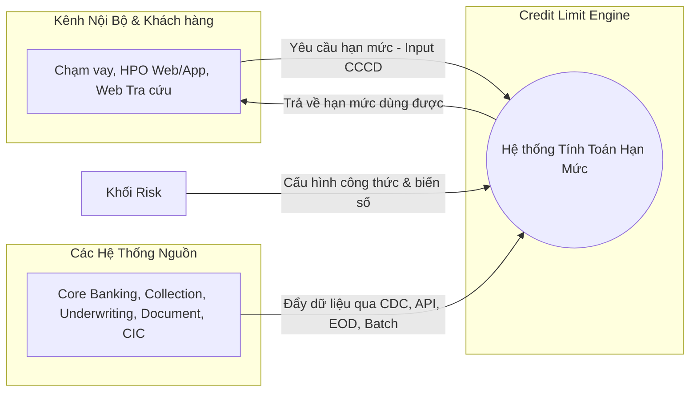
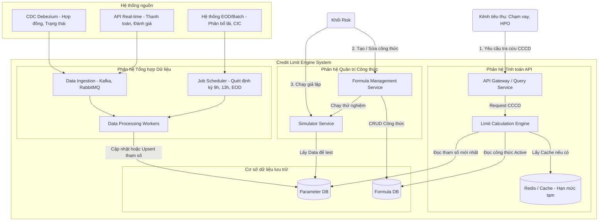

# Thiết Kế Hệ Thống: Credit Limit Engine (Hệ Thống Tính Toán Hạn Mức Tín Dụng)

## 0. Tóm tắt mục tiêu hệ thống
**Credit Limit Engine (CLE)** là hệ thống lõi giúp tính toán và cung cấp con số **"hạn mức dùng được"** của khách hàng cho bộ phận kinh doanh và các kênh nội bộ (Chạm vay, HPO web/app, website tra cứu). 

- **Đầu vào:** CCCD (Căn cước công dân) của khách hàng.
- **Đầu ra:** Hạn mức dùng được.
- **Quy tắc tính toán:** `Hạn mức dùng được = f(Hạn mức tổng, Các tham số/biến số)`. Trong đó, *Hạn mức tổng* gồm hạn mức vay và thẻ được thẩm định; công thức `f` do khối Risk cấu hình linh hoạt dựa trên các biến số đã thu thập.

---

## 1. Biểu đồ kiến trúc tổng quát (High-Level Architecture)
Biểu đồ này mô tả cách hệ thống CLE tương tác với các hệ thống bên ngoài (khu vực Data Sources) và các bên tiêu thụ (Consumers).

---

## 2. Biểu đồ kiến trúc chi tiết (Detailed System Design)
Biểu đồ này đi sâu vào các thành phần bên trong (Components) của hệ thống CLE và luồng xử lý dữ liệu (Data Pipeline).

---

## 3. Ý nghĩa và Thiết kế Cơ sở dữ liệu (Database Design)

Để hệ thống xử lý nhanh và linh hoạt, thiết kế Database nên chia làm 2 cụm chính: **Parameter DB** (Lưu biến số) và **Formula DB** (Lưu công thức).

### 3.1. Parameter DB (Cơ sở dữ liệu lưu trữ biến số khách hàng)
> [!TIP]
> Do các tham số có thể thêm mới/thay đổi liên tục, hệ thống nên sử dụng cấu trúc lưu trữ phân mảnh. Ví dụ dạng bảng tĩnh kết hợp dữ liệu động JSON (trong PostgreSQL/MySQL) hoặc hệ thống NoSQL (như MongoDB) để tăng tốc độ Đọc/Ghi liên tục (Read/Write) từ quá trình CDC.

*   **Bảng `Customer_Master`** (Thông tin định danh lõi):
    *   `customer_id` (Primary Key)
    *   `cccd` (Index - Dùng để tra cứu nhanh)
*   **Bảng `Demographic_Document_Params`** (Nhóm Nhân khẩu học & Tài liệu - Cập nhật từ Hợp đồng mới/Thẩm định qua CDC):
    *   `customer_id` (Foreign Key)
    *   `age`, `martial_status`, `gender`, `province_rs`, `education`, `profession`, `monthly_income`
    *   `doc_blx`, `doc_health_insurance`, `doc_vehicle_reg`, `doc_labor_contract`, `doc_business_license` (Trạng thái: yes/no, date hiệu lực)
*   **Bảng `Financial_Credit_Params`** (Nhóm Khoản vay, Collection, UW - Biến động liên tục qua CDC/EOD):
    *   `customer_id` (Foreign Key)
    *   `number_of_loans`, `max_fa` *(Cập nhật qua CDC khi giải ngân)*
    *   `total_interest_payment`, `living_emi_loan` *(Cập nhật qua EOD)*
    *   `total_outstanding_debt`, `last_payment_date_loan` *(Cập nhật Real-time/CDC khi thanh toán)*
    *   `no_of_COL_negative_remark` *(Nhóm Thu hồi nợ)*
    *   `no_if_CUN_hard_code` *(Nhóm Thẩm định)*
    *   `cic_r18_group` *(Cập nhật qua Batch hàng tháng)*

### 3.2. Formula DB (Cơ sở dữ liệu lưu trữ và quản trị công thức)
> [!NOTE]
> Database này phục vụ riêng cho Khối Risk để thao tác nghiệp vụ, cấu hình tham số mà không cần code.

*   **Bảng `Formulas`**:
    *   `id` (Primary Key)
    *   `name` (Tên công thức)
    *   `expression` (Đoạn mã JSON hoặc AST Parser lưu trữ logic. Ví dụ: `IF(age > 18) THEN MIN(ParamA, ParamB) ELSE 0`)
    *   `status` (Trạng thái công thức: `BUILDING` (đang xây), `SIMULATED` (đã test), `OFFICIAL` (chính thức))
    *   `version` (Phiên bản công thức, vd: v1, v2)
    *   `scheduled_apply_time` (Thời gian dự kiến áp dụng thay thế bản chính thức)
*   **Bảng `Formula_Simulations`**:
    *   `formula_id` (Foreign Key)
    *   `target_group_conditions` (Điều kiện tập khách hàng được chọn để giả lập)
    *   `simulation_results` (Kết quả mô phỏng trả về để Risk phê duyệt)

---

## 4. Các Giai Đoạn Xử Lý & Vận Hành (Processing Steps)

### Bước 1: Tổng hợp các tham số / biến số (Data Ingestion Pipeline)
1. **Qua luồng CDC / API Real-time:** Khi có Hợp đồng thay đổi sang `Đã Ký` / `Đã Giải Ngân` (Core) hoặc Khách hàng thanh toán khoản vay, đánh giá nợ xấu (COL), trạng thái chứng từ (CUN)... Hệ thống lõi phát ra các Event qua CDC (như Debezium + Kafka). Engine có các Worker liên tục bắt các thông điệp này và `Cập nhật trực tiếp` (Upsert) vào **Parameter DB**.
2. **Qua luồng EOD / Scheduler:** Đối với dữ liệu phức tạp đòi hỏi tính toán chéo vào cuối ngày như `total_interest_payment` (tổng lãi thanh toán phân bổ) hoặc quét khung giờ (9h00, 13h00), hệ thống Job Scheduler sẽ chạy các quy trình Batch. Kết thúc chuỗi Batch, giá trị sẽ được tổng hợp và ghi vào **Parameter DB**.

### Bước 2: Cấu hình công thức (Formula Configuration by Risk)
1. Chuyên viên Khối Risk thao tác trên Giao diện Quản trị.
2. Chọn các biến số được định nghĩa ở Bước 1 và áp dụng các **toán tử** toán học / logic (`+`, `-`, `*`, `/`, `min`, `max`, `floor`, `ceiling`, `round`, `if-then`...).
3. Công thức lưu lại dưới bản `BUILDING`.
4. Risk chạy thử **Simulator** dựa trên các nhóm khách hàng cụ thể. Engine tính toán thử nghiệm bằng bộ dữ liệu thực tế tại Database.
5. Khi thoả mãn, Risk thiết lập cấu hình **thời gian dự kiến áp dụng**, công thức này sẽ chuyển sang `OFFICIAL` đúng lúc thời điểm đó.

### Bước 3: Tiêu thụ dữ liệu - Trả kết quả (Runtime Execution)
1. Kênh tra cứu nội bộ (Chạm vay / HPO / Web) gọi vào API Gateway với tham số `CCCD`.
2. **Limit Calculation Engine** sẽ lấy công thức đang trạng thái `OFFICIAL`.
3. Engine truy xuất lấy tham số Real-time / EOD của khách hàng này trong Parameter DB.
4. Xử lý công thức động và trả kết quả `Hạn mức dùng được` về cho hệ thống tra cứu ngay lập tức.
