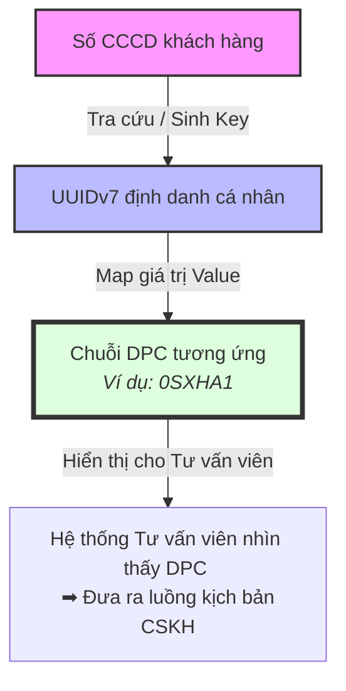

# Tổng quan về DPC (Dynamic Product Code / Customer Profile Code)

## 1. DPC là gì?
DPC là một chuỗi cấu trúc gồm **6 ký tự** (bao gồm các chữ số từ 0-9 và chữ cái từ A-Z). Mỗi ký tự tại một vị trí cụ thể sẽ mang một ý nghĩa riêng biệt nhằm thể hiện loại sản phẩm, phân khúc khách hàng, hạng mức được ưu tiên và tỷ lệ rủi ro của từng khách hàng. DPC cung cấp một định dạng nhận diện vô cùng nhanh và hiệu quả cho nhân viên nghiệp vụ và hệ thống mà không cần đi sâu vào chi tiết của từng hồ sơ khách hàng.

## 2. Mục đích sử dụng
- **Nhận diện nhanh chóng**: DPC giúp tư vấn viên và các bộ phận nghiệp vụ chỉ cần nhìn vào mã 6 ký tự là có thể hiểu được chân dung tổng quan của khách hàng phục vụ cho quy trình tư vấn.
- **Tùy biến kịch bản chăm sóc**: Dựa vào DPC, tư vấn viên có thể dễ dàng biết được khách hàng đang ở trạng thái nào (ví dụ: đã tất toán khoản vay cũ, đang dùng thẻ, hay chưa từng sử dụng dịch vụ) để có thể tiến hành chào mời các sản phẩm mới phù hợp nhất.
- **Hỗ trợ Hệ thống tự động**: Các hệ thống (như CU Tools, System Rules) có thể dựa vào DPC để ra định tuyến luồng duyệt theo quy tắc (Rule Engine) và tự động hóa quy trình phê duyệt rủi ro.

## 3. Kiến trúc bảo mật Dữ liệu Khách hàng (Data Privacy)
Để đảm bảo an toàn thông tin cá nhân của khách hàng, hệ thống tuân thủ nguyên tắc **không sử dụng** trực tiếp số Căn cước công dân (CCCD) làm key định danh để giao tiếp hay hiển thị tường minh cho người dùng trên mạng lưới chi nhánh nhằm chống rò rỉ dữ liệu (Data Leakage). 

Thay vào đó, cơ chế hoạt động được mô phỏng như sau:
1. **Đầu vào (Input)**: Ghi nhận số lượng CCCD từ hoạt động cấp mới của khách hàng.
2. **Ánh xạ Key (Key Mapping)**: Hệ thống ánh xạ mã CCCD ra một mã định danh ngẫu nhiên chuẩn hóa định dạng **`uuidv7`**. Khóa `uuidv7` này sẽ được dùng làm khóa truy cập chung (Identity Key).
3. **Hiển thị & Tra cứu (Display & Retrieval)**: Khóa `uuidv7` (đóng vai trò là thông tin tra cứu) sẽ được map vào chuỗi giá trị tương ứng là chuỗi **`DPC`** (đóng vai trò là Value). Các màn hình giao diện của tư vấn viên khi tra cứu theo CCCD sẽ ẩn đi CCCD phía Front-End và chỉ hiển thị mã DPC này cho tư vấn viên xem.

