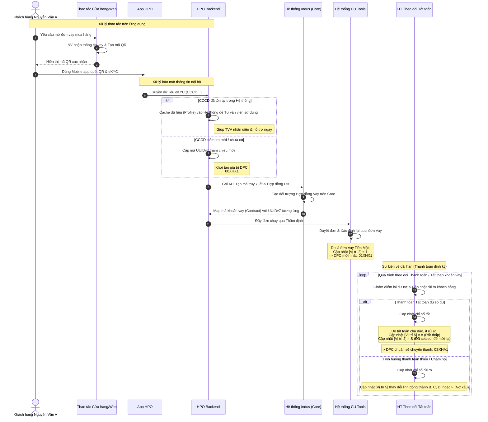
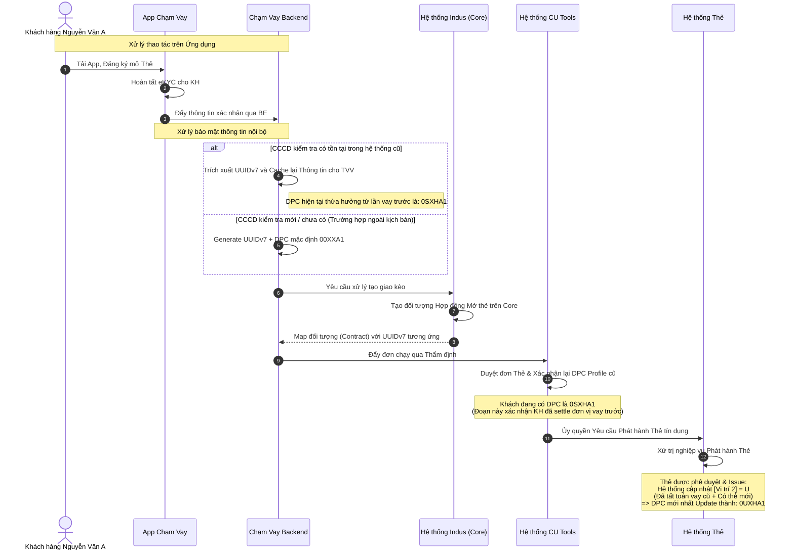

# Luồng Xử lý và Cập nhật DPC theo Sự kiện (Use Case Flows)

Tùy thuộc vào ứng dụng Onboard dành cho khách hàng (ví dụ quyết định bằng **Vị trí 4** trong DPC) và các sự kiện nghiệp vụ phát sinh sau đó mà chuỗi DPC sẽ được tạo mới và luân chuyển cập nhật định kỳ vào trong hệ thống. Dưới đây là 2 luồng ví dụ tiêu biểu thể hiện rõ chức năng này.

---

## Luồng 1: Khách hàng đến cửa hàng tạo tiếp nhận đơn vay 

**Ngữ cảnh (Kịch bản):** Khách hàng *Nguyễn Văn A* đến cửa hàng của Công ty để tạo một hợp đồng/đơn vay mua hàng.

### 1. Sơ đồ các luồng xử lý (Sequence Diagram)

### 2. Sự tiến hóa chuỗi DPC trong Luồng 1
1. Khởi tạo đầu vào: **`00XHX1`** — Khách hàng sau khi eKYC hoàn tất nhưng lại chưa được thiết định DB khoản vay (`H` = Từ HPO).
2. Khi hợp đồng sinh ra: **`01XHX1`** — Khi hệ thống nội bộ duyệt đơn vay là loại Vay (Vị trí 2 thay đổi bằng `1`).
3. Khách hàng đã Tất toán xong: **`0SXHA1`** — Tất toán chu đáo làm Vị trí 5 thành `A` (Rating Rất tuyệt vời) và Vị trí 2 bằng `S` (Mời tiếp tục Vay - Cho luồng sau).

---

## Luồng 2: Khách hàng Mở Ứng dụng Tạo đơn Mở thẻ 

**Ngữ cảnh (Kịch bản):** Khách hàng *Nguyễn Văn A* quyết định tải ứng dụng Mobile để đăng ký thêm một Hợp đồng Mở Thẻ mới (Với giả định KH này là KH được thừa hưởng từ quy trình Luồng 1 đã có sẵn DPC sau khi Tất Toán chu đáo là: `0SXHA1`).

### 1. Sơ đồ các luồng xử lý (Sequence Diagram)

### 2. Sự tiến hóa chuỗi DPC trong Luồng 2
Trong kịch bản KH **đã** tồn tại từ Luồng 1 có lịch sử:
1. Thông tin thừa hưởng: **`0SXHA1`** — Backend check CCCD thấy khách hàng này đã tất toán đợt vay cũ từ nhánh `HPO`. Kênh `H` sẽ được kế thừa trên Profile. Tình trạng cũ cũng là đã thanh toán (`S`) và Rating Nội bộ là (`A`). 
2. Có đơn mở thẻ cập nhật mới: **`0UXHA1`** — Ngay khi xử lý phát hành Thẻ mới diễn ra tại Core backend, Hệ thống Thẻ thay đổi Vị trí 2 thành trạng thái (`U`) thể hiện KH tiềm năng đã rải vay cũ xong mà có Thẻ đã và đang hoạt động.
*(Trong trường hợp KH mới hoàn toàn không qua vay lần 1, thường mã DPC sinh qua App Chạm Vay sẽ là 00XXA1 - Kênh App là `A`)*.
