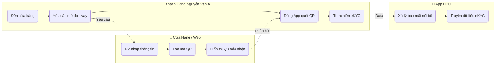
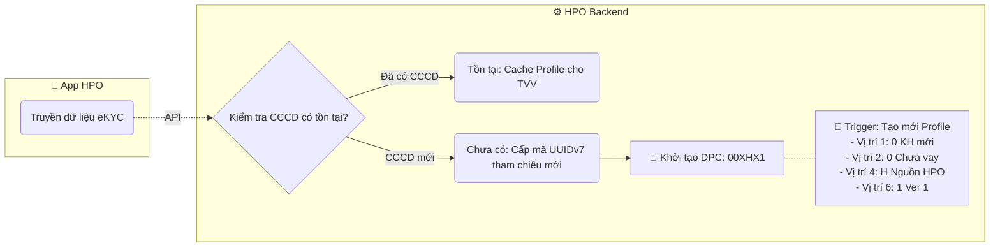
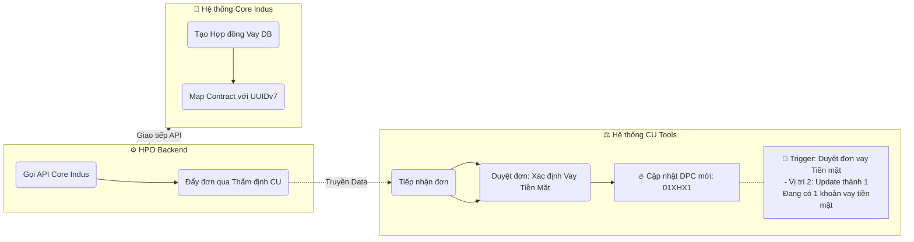
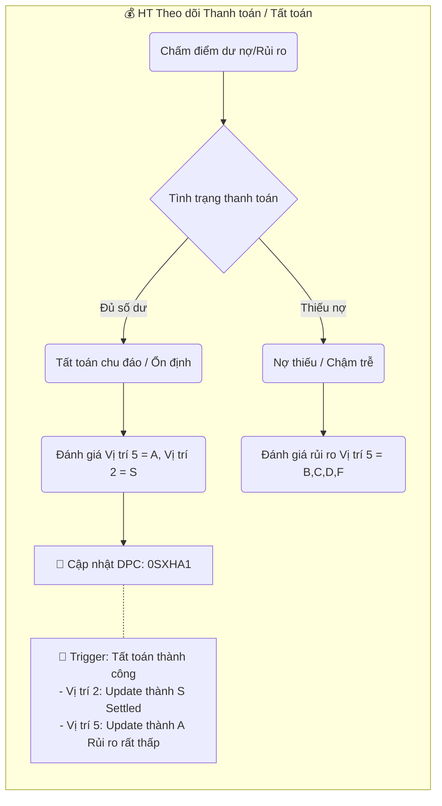
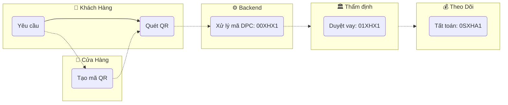
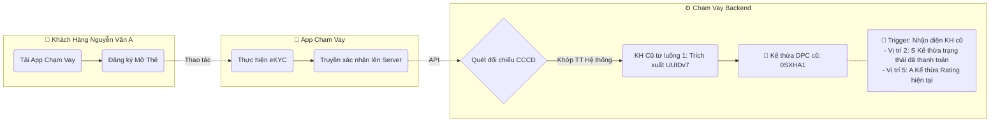
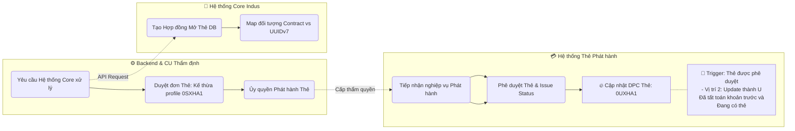

# Trình bày Luồng xử lý DPC (Flowchart Mở Rộng)

Tài liệu này trình bày luồng xử lý DPC theo định dạng **Cấu trúc Thuyết trình**.
- **Chiều ngang**: Giao tiếp và tương tác giữa các hệ thống (Services / Actors).
- **Chiều dọc**: Trình tự các bước xử lý chi tiết bên trong từng hệ thống.
- **Tính năng Mở rộng (Expandable)**: Ứng dụng các block `
` kết hợp với `
` để người thuyết trình có thể tự do thu gọn hoặc phóng to từng cụm tính năng theo tiến độ báo cáo.

---

## Luồng 1: Khách hàng đến cửa hàng tạo tiếp nhận đơn vay

*(💡 Click vào từng phần để mở rộng cụm quy trình tương ứng)*

<b>1️⃣ Phần 1: Tiếp nhận yêu cầu & Định danh eKYC</b>

<b>2️⃣ Phần 2: Xử lý Backend & Sinh DPC Ban Đầu</b>

<b>3️⃣ Phần 3: Tạo hợp đồng & Cập nhật DPC Thẩm định</b>

<b>4️⃣ Phần 4: Thanh toán dài hạn & Tất toán</b>

<b>🗺️ Hiển thị Sơ đồ Toàn cảnh (Luồng 1 Tóm Tắt)</b>

---

## Luồng 2: Khách hàng Mở Ứng dụng Tạo đơn Mở thẻ

*(Giả định Khách hàng ở Luồng 1 đã tất toán xong ứng dụng)*

<b>1️⃣ Phần 1: Tải App, eKYC & Kế thừa DPC</b>

<b>2️⃣ Phần 2: Core Thẩm định & Phát hành Thẻ tín dụng</b>

