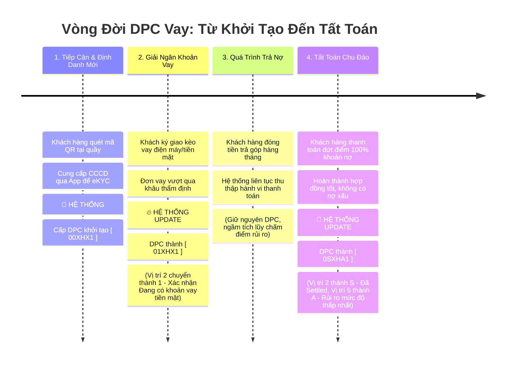
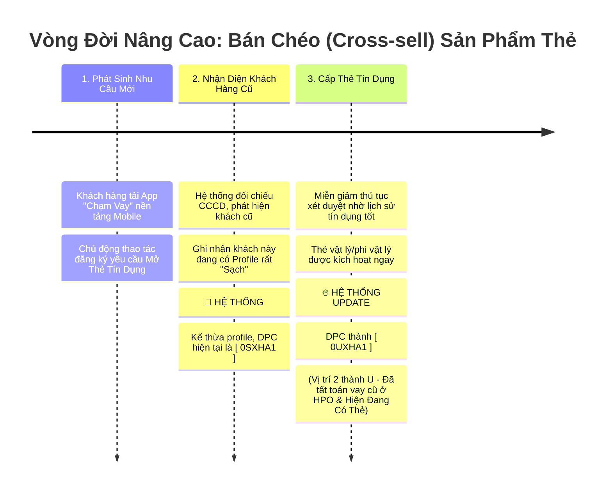

# Hành Trình Khách Hàng và Tác Động Dữ Liệu Lên DPC

Với những người dùng không chuyên về kỹ thuật (Business teams, Operation, Sales, hoặc các cấp quản lý), thay vì đọc Sơ đồ tuần tự (Sequence Diagram) với nhiều hệ thống và API phức tạp, việc tiếp cận theo dạng **Trục Thời gian (Timeline)** và **Hành trình Khách hàng (User Journey)** sẽ giúp luồng cập nhật DPC trở nên trực quan, sinh động và dễ nắm bắt hơn rất nhiều.

Cách trình bày này tập trung trả lời 2 câu hỏi cốt lõi:
1. Khách hàng định danh và tương tác với dịch vụ ra sao **theo chiều thời gian**?
2. Tại mỗi điểm chạm (Touchpoint), **dữ liệu khách hàng tác động làm DPC biến đổi như thế nào**?

---

## 1. Biểu đồ Timeline (Trục Thời Gian - Mốc Sự Kiện)

Biểu đồ Timeline là lựa chọn tuyệt vời nhất để trình bày trên các báo cáo (Presentation Slide). Cấu trúc này làm rõ mối quan hệ nguyên - nhân giữa "Hành động thực tế của khách hàng" dẫn đến "Nhãn dữ liệu DPC được cập nhật" qua thời gian.

### Kịch Bản 1: Vòng đời khoản vay đầu tiên (Từ lúc mới tinh đến khi hoàn thành)



### Kịch Bản 2: Mở rộng dịch vụ - Kế thừa dữ liệu để Mở Thẻ

*(Tiếp nối sau khi Khách hàng đã đạt mốc DPC Tốt `0SXHA1` ở kịch bản trên)*



---

## 2. Biểu đồ User Journey (Hành trình Trải nghiệm & Cảm xúc)

Ngoài Timeline ở trên, nếu bạn muốn nhấn mạnh vào **trải nghiệm của Khách hàng**, loại biểu đồ Journey này sẽ chia vai trò rõ ràng giữa việc Khách cần làm gì, và Hệ thống phải theo dõi dữ liệu ngầm ra sao. Các cột mốc DPC đóng vai trò như những "Thành tựu" dọc đường đi của người dùng.

```mermaid
journey
    title Trải nghiệm Khách hàng & Mốc cập nhật DPC
    
    section Giai đoạn 1: Mở Hồ Sơ Vay Mới
      Đến cửa hàng & Quét QR: 5: Khách hàng
      Cung cấp CCCD để eKYC: 4: Khách hàng, App
      Ghi nhận Hồ sơ (Gắn DPC: 00XHX1): 4: Hệ thống Backend
      
    section Giai đoạn 2: Xét duyệt & Duy trì
      Chờ đợi duyệt hồ sơ vay: 3: Khách hàng
      Duyệt Hợp Đồng (DPC -> 01XHX1): 5: Hệ thống Core
      Trả góp hàng tháng đều đặn: 4: Khách hàng
      
    section Giai đoạn 3: Tất toán khoản Vay
      Thanh toán thành công nợ kỳ cuối: 6: Khách hàng
      Ghi nhận Lịch sử Tốt (DPC -> 0SXHA1): 6: Hệ thống Đánh giá Rủi Ro

    section Giai đoạn 4: Đăng ký Thẻ Tín Dụng
      Lên App yêu cầu mở Thẻ tín dụng: 4: Khách hàng
      Thẩm định nhanh Profile (DPC: 0SXHA1): 5: Hệ thống Backend
      Phát hành Thẻ (DPC -> 0UXHA1): 6: Hệ thống Thẻ
```

---

## 🔥 Đánh giá hiệu quả của phương pháp trình bày này

1. **Thân thiện với non-IT:** Hoàn toàn loại bỏ các thuật ngữ về API, Queue xử lý, Database, Backend, hay Core System.
2. **DPC không còn trừu tượng:** Biến chuỗi số `00XHX1` thành một thực thể như "Tấm căn cước tín dụng" của khách. Khách hoàn thành nhiệm vụ nào, thẻ này được "Nâng cấp" lên tương ứng. 
3. **Phù hợp làm Slide / UI Flow:** Dễ dàng cắt ảnh (snip) các block timeline này để đưa thẳng lên các bài thuyết trình Pitching của đội ngũ Sản phẩm hoặc Kinh doanh (Business Development) mà không cần vẽ lại từ đầu.
