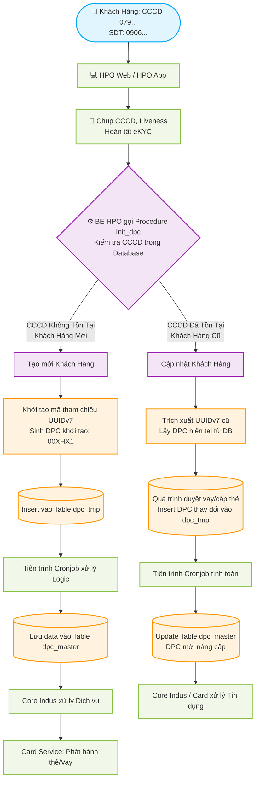

# Phân Tích Hành Trình Khách Hàng & Giao Tiếp Cơ Sở Dữ Liệu DPC

Dựa trên sơ đồ kiến trúc hệ thống, tài liệu này sẽ làm rõ luồng đi của khách hàng từ lúc còn là **Khách hàng mới (chưa có thông tin)** đến khi là **Khách hàng hiện hữu (đã có trong hệ thống - CSDL)**. Đi kèm với đó là minh hoạ về sự thay đổi dữ liệu trong các bảng Database khi DPC được cập nhật.

---

## 1. Flowchart Trải Nghiệm Khách Hàng và Logic Xử Lý Hệ Thống

Sơ đồ dưới đây gộp cả hai nhánh (Mới và Cũ) để hiển thị rõ luồng kiểm tra thông tin và điểm rẽ nhánh của hệ thống backend.

---

## 2. Minh Họa Biến Động Cơ Sở Dữ Liệu (Cập nhật DPC)

Theo thiết kế, hệ thống sử dụng cơ chế **Bảng Tạm (`dpc_tmp`)** để lưu log lịch sử (incremental data) và **Bảng Chính (`dpc_master`)** lưu trạng thái DPC mới nhất của khách hàng.

### 📌 Giai đoạn 1: Khách hàng mới hoàn tất eKYC (Khởi tạo DPC mặc định)

Lúc này Backend HPO không tìm thấy CCCD trong hệ thống, tự động sinh ra UUIDv7 và DPC mặc định (Ví dụ: `00XHX1`). Procedure `dpc_log()` sẽ Insert một dòng dữ liệu vào bảng tạm thời.
*(Quy tắc DPC khởi tạo: V1=0 [Khách chưa phân loại], V2=0 [Chưa dùng SP], V3=X, V4=H [Kênh HPO], V5=X [Chưa rủi ro], V6=1).*

**Bảng Tạm: `dpc_tmp` (Dữ liệu ghi nhận thao tác lần 1)**
| id | uuid_v7 | dpc_code | created_at | status |
| :--- | :--- | :--- | :--- | :--- |
| 1 | `123e4567-e89b...` | **00XHX1** | 2026-10-10 08:00 | PENDING |

Sau khi luồng xử lý đồng bộ chạy qua, dữ liệu chính thức được đẩy sang Bảng Master.

**Bảng Chính: `dpc_master` (Lưu thông tin định danh hệ thống)**
| uuid_v7 | current_dpc | updated_at | note |
| :--- | :--- | :--- | :--- |
| `123e4567-e89b...` | **00XHX1** | 2026-10-10 08:05 | Init new customer |

---

### 📌 Giai đoạn 2: Khách hàng hiện hữu phát sinh khoản vay (Thay đổi DPC)

Khi Khách hàng ký hợp đồng Vay tiền mặt qua HPO Web thành công, DPC sẽ thay đổi (Vị trí 2 từ `0` [Chưa vay] thành `1` [Có khoản vay tiền mặt]).
Lúc này vì CCCD đã có, procedure `init_dpc` sẽ trực tiếp lấy UUIDv7 cũ để làm Data Object cho các giao dịch mới. Hệ thống **Insert dòng mới thứ 2** vào bảng log `dpc_tmp`.

**Bảng Tạm: `dpc_tmp` (Log biến động thêm một Record)**
| id | uuid_v7 | dpc_code | created_at | status |
| :--- | :--- | :--- | :--- | :--- |
| 1 | `123e4567-e89b...` | 00XHX1 | 2026-10-10 08:00 | SUCCESS |
| 2 | `123e4567-e89b...` | **01XHX1** | 2026-11-15 09:30 | PENDING |

Cronjob xử lý bảng Tạm, tìm ra thông tin mới và Update bản ghi có cùng UUIDv7 bên bảng Master thay vì tạo mới.

**Bảng Chính: `dpc_master` (DPC đã được ghi đè bằng trạng thái mới nhất)**
| uuid_v7 | current_dpc | updated_at | note |
| :--- | :--- | :--- | :--- |
| `123e4567-e89b...` | **01XHX1** | 2026-11-15 09:35 | Loan approved |

---

### 📌 Giai đoạn 3: Khách hàng hiện hữu Tất toán Hợp đồng chu đáo

Tiếp tục hành trình, Khách hàng hoàn tất trả nợ đúng hạn. Core System gửi Signal cập nhật DPC mới: `0SXHA1` (Vị trí 2 thành S [Settled], Vị trí 5 thành A [Rủi ro siêu thấp]). 

**Bảng Tạm: `dpc_tmp` (Tiếp tục log lịch sử)**
| id | uuid_v7 | dpc_code | created_at | status |
| :--- | :--- | :--- | :--- | :--- |
| ...| ... | ... | ... | ... |
| 5 | `123e4567-e89b...` | **0SXHA1** | 2027-05-10 14:00 | PENDING |

**Bảng Chính: `dpc_master` (Final Data View Dashboard - Bảng duy nhất dùng để truy xuất khách hàng)**
| uuid_v7 | current_dpc | updated_at | note |
| :--- | :--- | :--- | :--- |
| `123e4567-e89b...` | **0SXHA1** | 2027-05-10 14:05 | Fully settled, low risk |

---

## 3. Tóm Lược Tư Duy Xử Lý
1. **Một Khách hàng - Một định danh duy nhất (UUIDv7)**: Dù CCCD có thể cung cấp nhiều lần ở các App (HPO Web, App), Procedure kiểm tra Database sẽ luôn lấy về đúng 1 UUIDv7 duy nhất (khép kín thông tin).
2. **Nguyên tắc Log Lịch sử trước (`dpc_tmp`)**: Để có thể track (theo vết) toàn bộ lịch sử biến đổi của khách hàng, mọi thay đổi DPC đều phải tạo ra một dòng Insert vào bảng Temporay (Nhờ vậy không bao giờ mất dấu tích).
3. **Cập nhật Master Data (`dpc_master`)**: Hệ thống sau đó dùng Job/Cron tính toán để đè giá trị DPC mới nhất vào cùng uuid_v7 tại Bảng gốc. Dashboard kinh doanh hoặc các hệ thống Tín dụng khác sẽ gọi API vào `dpc_master` để lấy ra chỉ số hạng Khách hàng chuẩn (latest).
