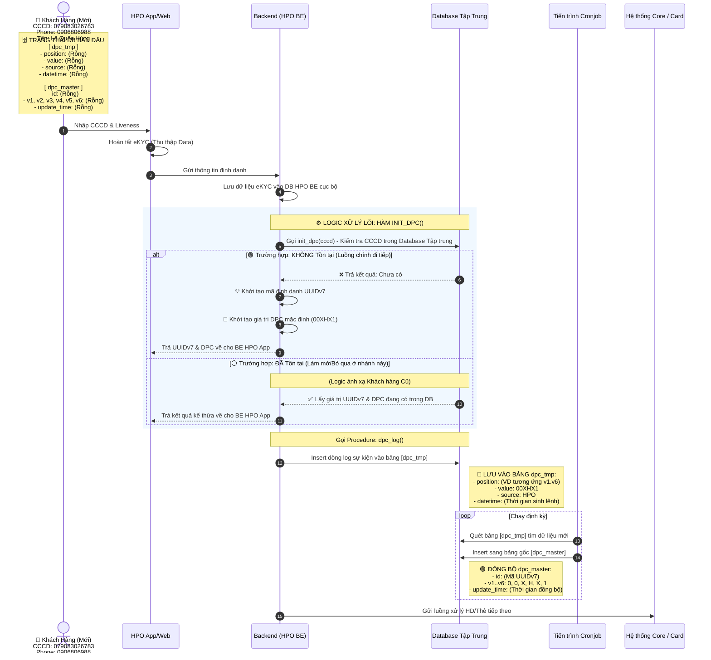
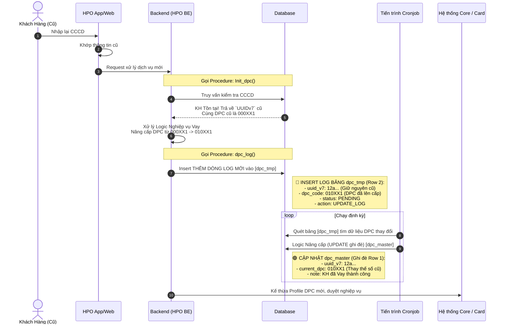

# Phân Tích Sequence Diagram & Logic Database Theo Luồng

Trả lời câu hỏi của bạn: **Việc kết hợp Sequence Diagram (Sơ đồ tuần tự) và Table Dữ liệu là cách tiếp cận TUYỆT VỜI NHẤT dành cho đội ngũ Kỹ thuật (Dev/BA/SA)**. Sơ đồ tuần tự sẽ giải quyết bài toán "Thứ tự gọi hàm / API thế nào", trong khi Table dữ liệu sẽ giải quyết bài toán "Trạng thái lưu trữ DB ra sao sau mỗi lệnh gọi".

Để trực quan nhất, phần **Trạng thái Database (`dpc_tmp` và `dpc_master`) đã được nhúng trực tiếp vào Từng Điểm Chạm (Touchpoint)** ngay trong thân sơ đồ.

---

## Luồng 1: Khách Hàng Mới (Chưa có CCCD trong CSDL)

Đây là kịch bản khách hàng lần đầu tiên sử dụng dịch vụ thông qua HPO Web/App.

### 1.1 Sơ đồ tuần tự kèm Dữ liệu (Sequence Diagram + DB State)

### 1.2 Giải thích hành vi Dữ liệu
Ở luồng này, hệ thống sẽ thực thi lệnh **INSERT** ở cả 2 bảng. Tại bước 6, do là khách hàng mới hoàn toàn, DPC khởi tạo là `000XX1` được ghi nhận lập tức vào log `dpc_tmp`. Sau đó, tiến trình định kỳ của hệ thống (Cronjob) quét qua, lấy đúng log mới đó để **INSERT** làm bản ghi gốc (`dpc_master`) đại diện cho người dùng thông qua UUIDv7.

---

## Luồng 2: Khách Hàng Cũ (Đã có CCCD trong CSDL)

Đây là kịch bản khách hàng cũ quay lại, ví dụ để mở mới khoản vay tiền mặt hoặc thẻ tín dụng.

### 2.1 Sơ đồ tuần tự kèm Dữ liệu (Sequence Diagram + DB State)

### 2.2 Giải thích hành vi Dữ liệu
Khác với luồng 1, luồng quay lại này sẽ tiếp tục dùng hàm **INSERT** để thảy vào thêm một dòng báo cáo ở bảng Tạm (`dpc_tmp` row 2) tạo thành vết log thứ hai.
Tuy nhiên, khi tiến trình Cronjob chạy, nó không tạo mới mà thực hiện lệnh **UPDATE** - Tức là tìm bảng `dpc_master` tại dòng chứa mã uuid_v7 `12a...`, rồi **GHI ĐÈ** DPC mới `010XX1` đè lên con số DPC cũ. Nhờ vậy, trạng thái khách hàng luôn được Update Status mới nhất vào trong lõi.

---

## 🎯 Tại sao cách biểu diễn này tối ưu?

Việc trực tiếp đưa ghi chú **Table Data States (Trạng thái dữ liệu)** vào những điểm giao kết Database (Bước 6 và Bước 8) giúp:
1. **Liên kết luồng chạy - kết quả lưu trữ:** Người đọc không cần kéo xuống dưới để xem hệ quả của một API Call là gì nữa. Mọi thứ được phơi bày tức thời (Real-time tracking of DB State). 
2. **Khắc họa triết lý Design của hệ thống:** Trực quan thấy được cơ chế Insert nhồi thêm dữ liệu ở bảng log lịch sử (`dpc_tmp`), so với cơ chế Cập nhật ghi đè chốt số tại bảng Trạng thái (Master Data `dpc_master`). Trang bị đầy đủ cho Dev và Test/QA cách debug lỗi (nếu có).
