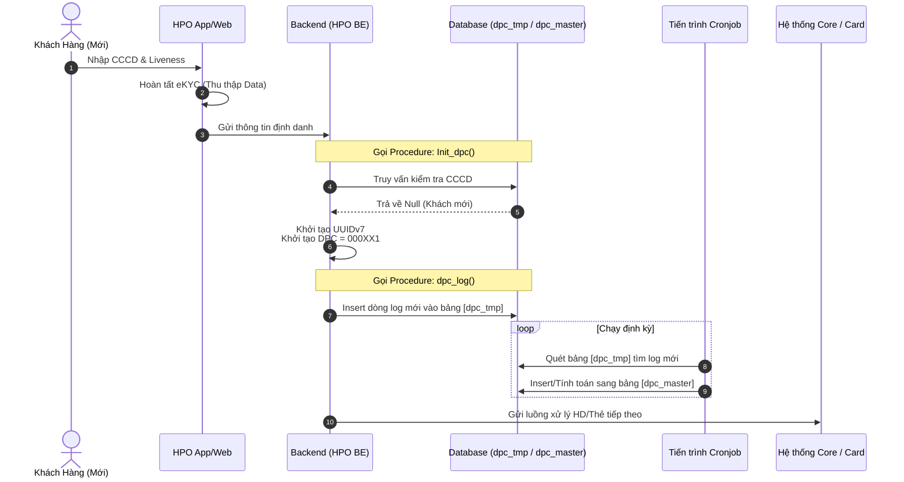
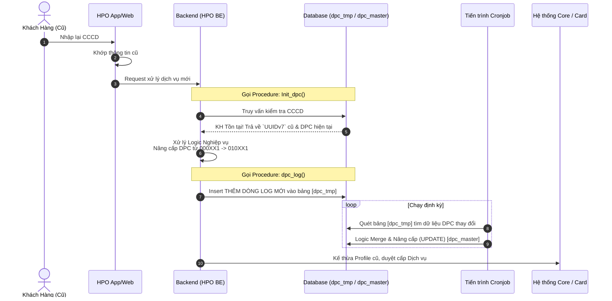

# Phân Tích Sequence Diagram & Logic Database Theo Luồng

Trả lời câu hỏi của bạn: **Việc kết hợp Sequence Diagram (Sơ đồ tuần tự) và Table Dữ liệu là cách tiếp cận TUYỆT VỜI NHẤT dành cho đội ngũ Kỹ thuật (Dev/BA/SA)**. Sơ đồ tuần tự sẽ giải quyết bài toán "Thứ tự gọi hàm / API thế nào", trong khi Table dữ liệu sẽ giải quyết bài toán "Trạng thái lưu trữ DB ra sao sau mỗi lệnh gọi".

Dưới đây, mình đã tách rõ 2 luồng từ ảnh gốc thành 2 cụm **Sequence Diagram + Data Table** tương ứng để tài liệu cực kỳ dễ theo dõi.

---

## Luồng 1: Khách Hàng Mới (Chưa có CCCD trong CSDL)

Đây là kịch bản khách hàng lần đầu tiên sử dụng dịch vụ thông qua HPO Web/App.

### 1.1 Sơ đồ tuần tự (Sequence Diagram)

### 1.2 Trạng thái Table Dữ liệu song song

Ở luồng này, hệ thống sẽ thực thi lệnh **INSERT** ở cả 2 bảng.

**Giai đoạn 1: Khi Backend gọi `dpc_log()` ở Bước 6**
Bảng Tạm (Log biến động) phát sinh 1 record nguyên thủy chưa qua xử lý đồng bộ.
| Table `dpc_tmp` | uuid_v7 | dpc_code | status | action |
| :--- | :--- | :--- | :--- | :--- |
| **Row 1** | `12a...` | **000XX1** | PENDING | INSERT |

**Giai đoạn 2: Khi Cronjob quét qua ở Bước 8**
Dữ liệu chính thức được đưa vào Master, lúc này `uuid_v7` trở thành mỏ neo (anchor) duy nhất của khách hàng này cho toàn hệ thống.
| Table `dpc_master` | uuid_v7 | current_dpc | note |
| :--- | :--- | :--- | :--- |
| **Row 1** | `12a...` | **000XX1** | Khách mới tinh |

---

## Luồng 2: Khách Hàng Cũ (Đã có CCCD trong CSDL)

Đây là kịch bản khách hàng cũ quay lại, ví dụ để mở mới khoản vay tiền mặt hoặc thẻ tín dụng.

### 2.1 Sơ đồ tuần tự (Sequence Diagram)

### 2.2 Trạng thái Table Dữ liệu song song

Khác với luồng 1, luồng này sẽ thực thi lệnh **INSERT** ở bảng Tạm, nhưng lại là lệnh **UPDATE** ở bảng Master.

**Giai đoạn 1: Khi Backend gọi `dpc_log()` ở Bước 7**
Hệ thống KHÔNG SỬA lịch sử cũ. Nó **thêm (Insert)** một dòng mới vào bảng `dpc_tmp` để ghi vệt (tracking) sự thay đổi.
| Table `dpc_tmp` | uuid_v7 | dpc_code | status | action |
| :--- | :--- | :--- | :--- | :--- |
| Lịch sử cũ | `12a...` | 000XX1 | SUCCESS | INSERT |
| **Log Mới (Row 2)** | `12a...` | **010XX1** | PENDING | UPDATE_LOG |

**Giai đoạn 2: Khi Cronjob đối chiếu ở Bước 9**
Tiến trình Batch/Cronjob sẽ quét bảng Tạm, tìm record dòng 2 mới xuất hiện. Nó nhận thấy DPC đã đổi từ `000XX1` thành `010XX1`. Hệ thống bắt đầu **UPDATE ghi đè** vào record có cùng UUIDv7 bên bảng Master.
| Table `dpc_master` | uuid_v7 | current_dpc | note |
| :--- | :--- | :--- | :--- |
| **Row 1** *(Bị ghi đè Status)* | `12a...` | ~~000XX1~~ 🔥 **010XX1** | KH Có khoản vay |

---

## 🎯 Tại sao cách biểu diễn này giải quyết trọn vẹn bức ảnh thiết kế?

Ảnh bạn đưa gồm: Trải nghiệm App -> Logic BE -> Tương tác DB -> Đồng bộ ra sao. Tất cả các dữ kiện này đều được hệ thống hóa qua Sequence Diagram:
1. **Kiểm soát tính tuần tự:** Ai gọi trước, ai lấy data ra, ai insert vào.
2. **Kiểm soát luồng đồng bộ (Asynchronous):** Sự ngăn cách giữa luồng User và Luồng Hệ thống (Tiến trình định kỳ chạy ngầm Cronjob) được thể hiện cực mượt qua khối `loop Chạy định kỳ`.
3. **Kết nối Table DB:** Data table giải thích trực tiếp hệ quả của từng hàm Procedure quan trọng (`Init_dpc`, `dpc_log`) lên Database giúp Database Architect hay Backend Dev dễ dàng code sát với thiết kế.
