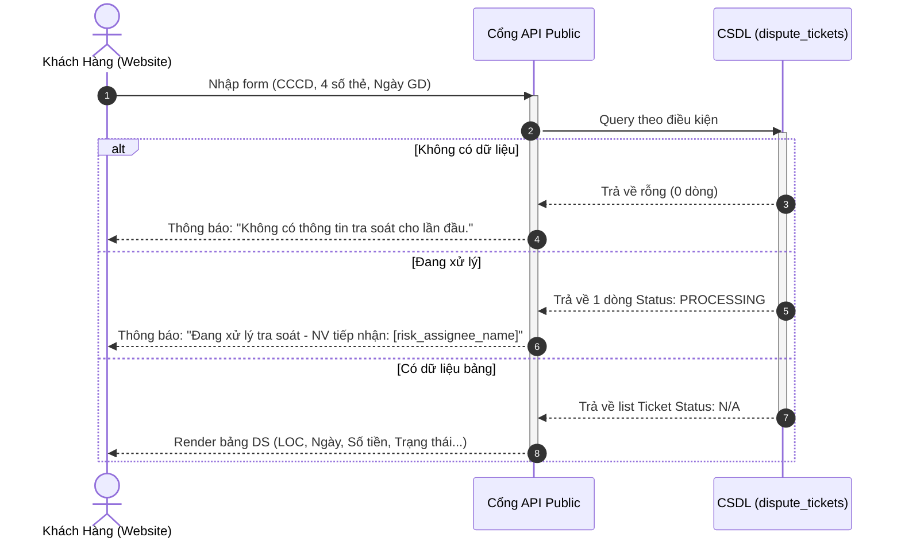
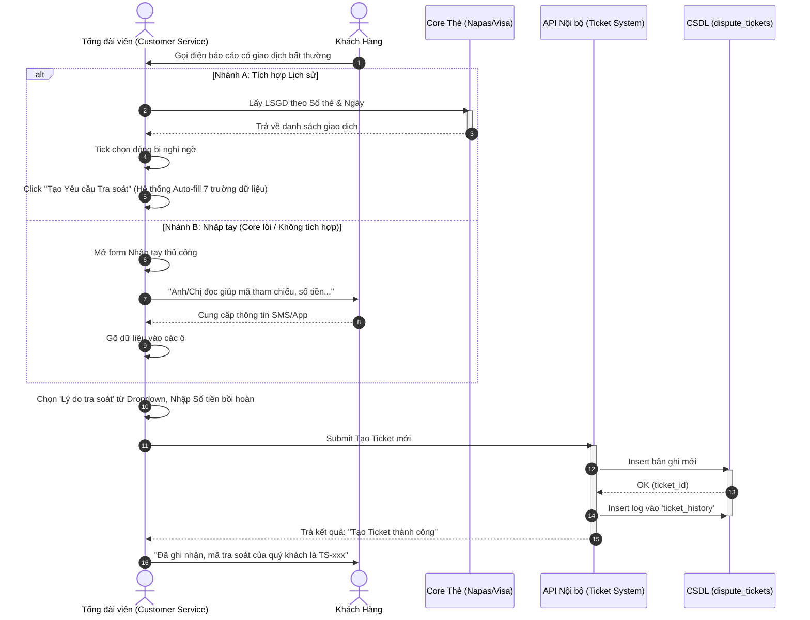
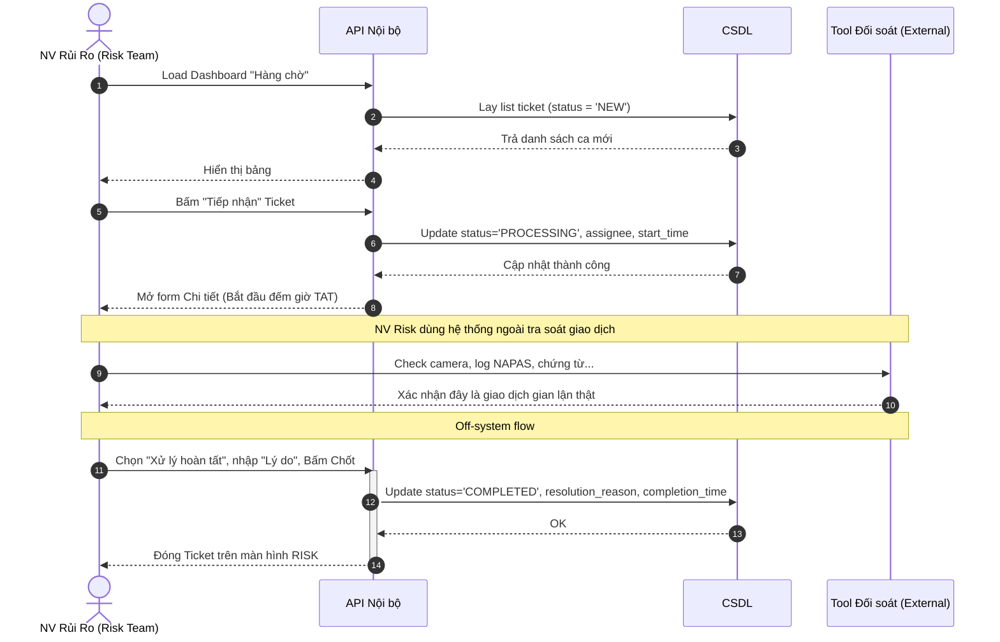
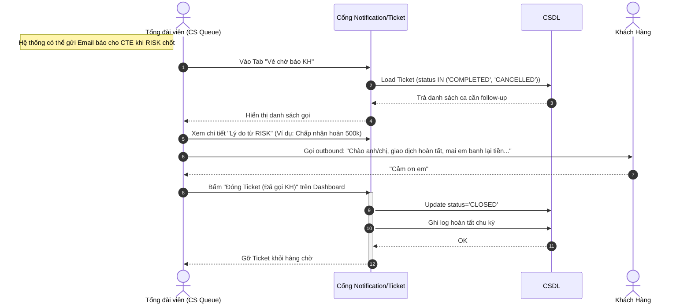

# Sơ đồ Luồng Nghiệp vụ (Flowcharts) - Tra soát Giao dịch Thẻ

Tài liệu này sử dụng Mermaid.js để trực quan hóa các luồng xử lý chính trong hệ thống thông qua sơ đồ tuần tự (Sequence Diagram).

---

## 1. Luồng Khách Hàng tự Tra Cứu trên Website
Luồng này mô tả cách khách hàng truy cập cổng thông tin công khai để xem tình trạng xử lý vé tra soát của mình.

---

## 2. Luồng Tổng Đài Viên (CTE) Báo cáo & Tạo Ticket
Luồng mô tả cách CTE thao tác khi khách hàng gọi điện nhờ báo cáo xử lý. Sơ đồ thể hiện cả 2 nhánh (Tích hợp Auto-fill và Nhập tay).

---

## 3. Luồng Bộ phận RISK Tiếp nhận & Xử lý
Sơ đồ minh họa quá trình của NV RISK từ lúc mở Dashboard xem ca chờ đến lúc đưa ra quyết định Hủy/Hoàn tất.

---

## 4. Luồng CTE Thông báo cho KH và Hoàn tất Vòng đời
Sau khi RISK chốt hồ sơ, hệ thống báo về cho CTE để CTE gọi xác nhận lại lần cuối cho Khách hàng.

