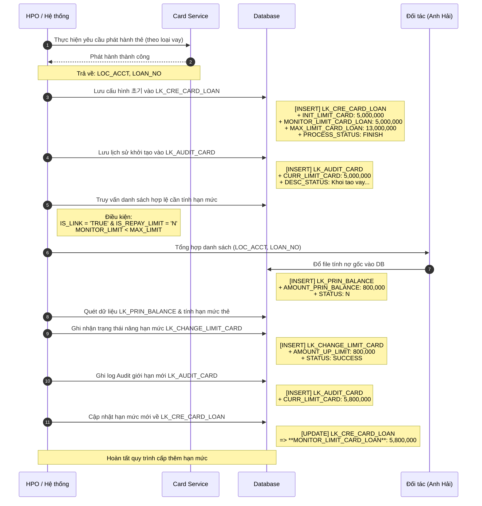

# Quy trình xử lý Vay qua thẻ (Luồng 1)

Tài liệu này bao gồm **Flowchart**, **Sequence Diagram** (Sơ đồ tuần tự) và làm nổi bật **chi tiết các trường dữ liệu (Fields & Values)** bị thay đổi/cập nhật sau mỗi bước theo luồng xử lý thu thập nợ gốc để nâng hạn mức thẻ thông qua đối tác.

---

## 1. Sequence Diagram (Sơ đồ Tuần tự)
Sơ đồ thể hiện luồng tương tác giữa các thành phần và cụ thể các giá trị trong DB được cập nhật tại từng thời điểm.



---

## 2. Flowchart (Sơ đồ Khối)
Biểu diễn tổng quát luồng các bước từ lúc bắt đầu cho đến khi kết thúc bản ghi thay đổi định kỳ hạn mức.

```mermaid
flowchart TD
    %% Định nghĩa các bước chính
    subgraph Bước 1: Khởi tạo thẻ
        A[HPO gọi Card Service phát hành thẻ]
        A -- Thành công --> B((Lấy thông tin: <br/>LOC_ACCT, LOAN_NO))
        B --> C[(Lưu vào bảng<br/>LK_CRE_CARD_LOAN)]
        C --> D[(Lưu vào bảng<br/>LK_AUDIT_CARD)]
    end

    subgraph Bước 2: Tương tác đối tác
        D --> E[Tổng hợp các khoản vay <br/>chưa trả hết nợ gốc]
        E -- Query LK_CRE_CARD_LOAN --> F(Gửi danh sách <br/>cho đối tác / Anh Hải)
    end

    subgraph Bước 3: Đổ dữ liệu trả nợ định kỳ
        F --> G[Đối tác bóc tách & cung cấp Data]
        G --> H[(Lưu vào bảng<br/>LK_PRIN_BALANCE)]
    end

    subgraph Bước 4: Xử lý nâng hạn mức thẻ (Tự động/Job)
        H --> I[Hệ thống quét dữ liệu nợ gốc của đối tác]
        I -- Tính lại Limit --> J[(Lưu vào bảng<br/>LK_CHANGE_LIMIT_CARD)]
        J --> K[(Lưu lịch sử mới vào <br/>LK_AUDIT_CARD)]
        K --> L[(Cập nhật MONITOR_LIMIT <br/>vào LK_CRE_CARD_LOAN)]
    end

    %% Style cho biểu đồ
    classDef default fill:#f9f9f9,stroke:#333,stroke-width:1px;
    classDef db fill:#e1f5fe,stroke:#0288d1,stroke-width:2px;
    classDef process fill:#f3e5f5,stroke:#8e24aa,stroke-width:2px;
    
    class A,E,G,I process;
    class C,D,H,J,K,L db;
```

---

## 3. Theo dõi Data Dòng chảy (Các trường làm đậm)

Dưới đây là sự thay đổi cục bộ sau mỗi bước tương tác của hệ thống, các giá trị thay đổi quan trọng được **IN ĐẬM**.

### 🔹 Hành động 1: Cấp thẻ thành công & Tạo gốc
* **Hành động:** Insert thông tin sau khi có phản hồi từ Card Service.
* **Bảng:** `LK_CRE_CARD_LOAN`
  * Dữ liệu định danh: `LOC_ACCT`, `LOAN_NO`
  * `IS_LINK`: **`TRUE`** *(Thẻ liên kết khoản vay)*
  * `INIT_LIMIT_CARD`: **`5,000,000`** *(Hạn mức thẻ khởi tạo)*
  * `MONITOR_LIMIT_CARD_LOAN`: **`5,000,000`** *(Hạn mức hiện tại/Hạn mức theo dõi)*
  * `MAX_LIMIT_CARD_LOAN`: **`13,000,000`** *(Hạn mức trần tối đa)*
  * `PROCESS_STATUS`: **`FINISH`**
* **Bảng:** `LK_AUDIT_CARD`
  * `CURR_LIMIT_CARD`: **`5,000,000`**
  * `DESC_STATUS`: **`Khoi tao vay qua the luong 1`**

### 🔹 Hành động 2: Query dữ liệu xuất file cho Đối tác
* **Hành động:** Select dữ liệu lấy `LOC_ACCT`, `LOAN_NO`.
* **Điều kiện:** `IS_LINK = TRUE` VÀ `IS_REPAY_LIMIT = N` VÀ `MONITOR_LIMIT_CARD_LOAN < MAX_LIMIT_CARD_LOAN`

### 🔹 Hành động 3: Đổ dữ liệu nợ gốc từ Đối tác
* **Hành động:** Insert dữ liệu thu thập khoản khách trả kỳ hạn hiện hành.
* **Bảng:** `LK_PRIN_BALANCE`
  * `AMOUNT_PRIN_BALANCE`: **`800,000`** *(Tiền gốc đã trả để nâng)*
  * `STATUS`: **`N`** *(Chưa xử lý nâng limit)*

### 🔹 Hành động 4: Xử lý thành công việc Nâng Hạn Mức
* **Hành động:** Hệ thống quét bản ghi của bảng balance và tính toán hạn mức mới (Hạn mức cũ `5M` + `800K` nợ gốc = **`5.8M`**).
* **Bảng:** `LK_CHANGE_LIMIT_CARD` (Insert)
  * `AMOUNT_UP_LIMIT`: **`800,000`** *(Cộng thêm)*
  * `STATUS`: **`SUCCESS`** *(Đã xử lý)*
* **Bảng:** `LK_AUDIT_CARD` (Insert)
  * `CURR_LIMIT_CARD`: **`5,800,000`**
  * `DESC_STATUS`: **`Nang han muc the theo khoan vay LOAN...`**
* **Bảng:** `LK_CRE_CARD_LOAN` (**UPDATE**)
  * `MONITOR_LIMIT_CARD_LOAN`: Chuyển từ `5,000,000` ➡️ **`5,800,000`**
  * `UPDATE_TIME`: **`[Thời điểm hiện tại]`**
